## GraphRAG vs VectorRAG vs HybridRAG: A Multi-Model Benchmarking Study with Fine-Tuning and Prompt Engineering Analysis
This project is a benchmarking system for comparing different RAG pipelines across multiple LLM backends. The main goal was to understand when VectorRAG, GraphRAG, and HybridRAG work well, where they fail, and how much retrieval strategy affects answer quality.

The project includes a benchmark runner, structured evaluation, hallucination scoring, retrieval evidence inspection, latency tracking, and a Streamlit dashboard for analyzing the results.

## What This Project Does

This system compares four main retrieval setups:

VectorRAG
GraphRAG
HybridRAG
Optimized GraphRAG V2

The benchmark was run across multiple answer models:

OpenAI
NVIDIA
Groq
Local Llama 3.2 1B
Fine-tuned Local Llama 3.2 1B

Each pipeline was tested on a fixed evaluation set of 70 questions. The outputs were scored using structured metrics such as correctness, faithfulness, evidence quality, hallucination score, refusal handling, and overall score.

## Why I Built This

A normal RAG system is usually evaluated only by checking whether the answer looks correct. That is not enough for comparing different retrieval strategies.

For this project, I wanted to answer questions like:

Does HybridRAG actually perform better than VectorRAG?
Where does GraphRAG fail?
Can better Cypher generation improve GraphRAG?
How do cloud models compare with local and fine-tuned models?
Which pipeline gives the best balance between quality and latency?

The result is a complete benchmark and analysis workflow instead of a simple chatbot demo.

## System Overview

The project has three main parts:

-RAG Pipelines
VectorRAG, GraphRAG, and HybridRAG pipelines retrieve context and generate answers.
-Benchmark and Evaluation Layer 
A benchmark runner executes the same question set across different model-pipeline configurations and stores the results in CSV format.
-Analytics Dashboard
A Streamlit dashboard reads the benchmark CSV and visualizes model quality, hallucination behavior, retrieval evidence, generated Cypher, latency, and resource readings.

## Evaluation Metrics

The benchmark records the following metrics for each run:

|        Metric	      |                      Meaning                             |
|-----------------------|----------------------------------------------------------|
|   correctness_score	|         How factually correct the answer is              |
|   faithfulness_score  |    Whether the answer is grounded in retrieved evidence  |
|  hallucination_score  |       Inverse signal of unsupported generation           |
|  evidence_score	      |      How well the answer uses available evidence         |
|     refusal_score	   |     Whether the system refuses correctly when needed     |
|     overall_score	   |               Combined quality score                     |
| local_latency_seconds	|          Local response time for the run                 |
|    generated_cypher   |        	 Cypher generated by GraphRAG                  |
|     graph_evidence	   |           Evidence retrieved from the graph              |
|    vector_evidence	   |        Evidence retrieved from vector search             |

## Benchmark Results

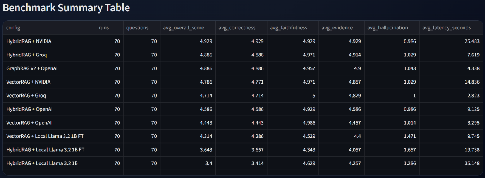

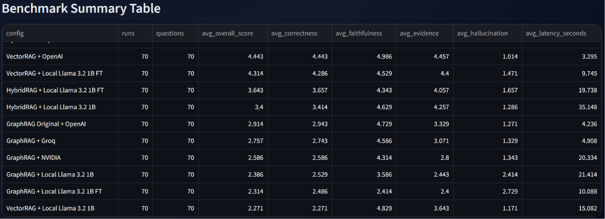

| Model                  | VectorRAG | GraphRAG | HybridRAG |
|------------------------|-----------|----------|-----------|
| OpenAI GPT-4o Mini     |   4.44    |   2.91   |   4.59    |
| NVIDIA NIM             |   4.79    |   2.93   |   4.93    |
| Groq                   |   4.71    |   2.76   |   4.89    |
| Llama3.2 1B Base       |   2.27    |   2.94   |   3.40    |
| Llama3.2 1B Fine-tuned |   4.31    |   2.83   |   3.64    |

## LANGSMITH
LangSmith is a comprehensive developer platform created by the team behind LangChain for tracing, evaluating, and monitoring AI and LLM (Large Language Model) applications

i used langsmith to trace the no of tokens used and the p50,p99 latency along with the error rate

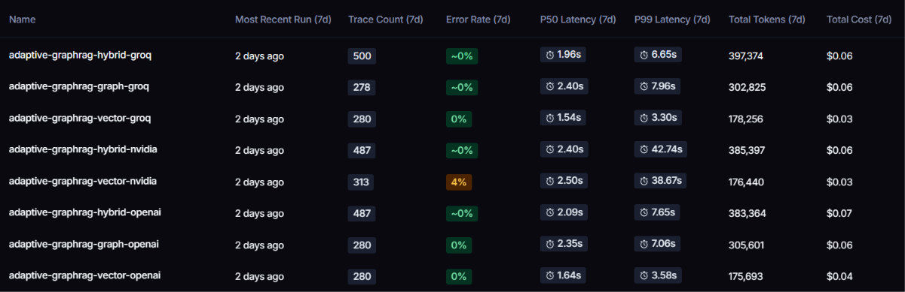
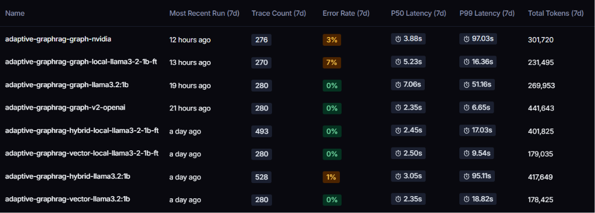
### Model Comparison

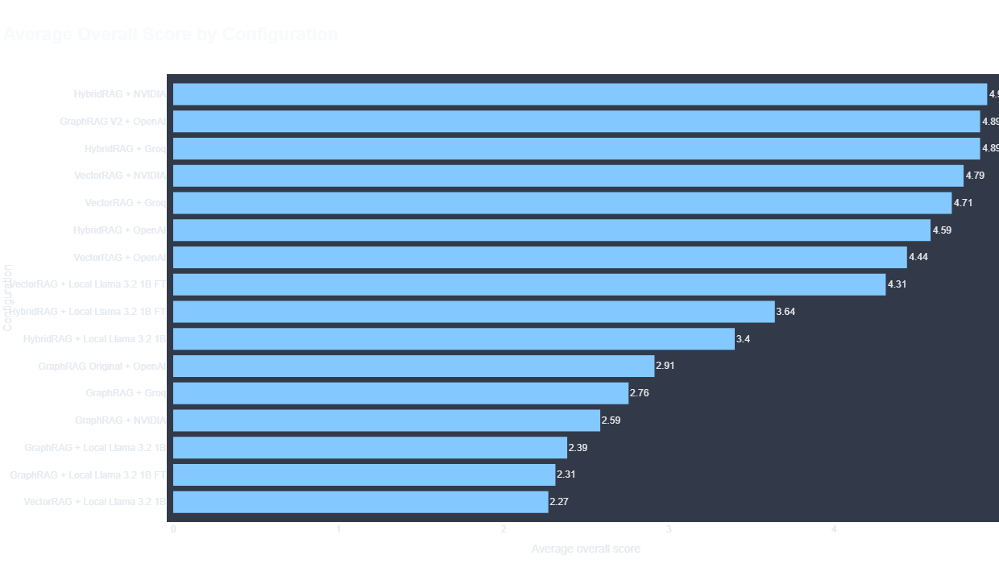

The fine-tuned Llama 1B model running locally on a laptop CPU scored 4.31 on VectorRAG — only 0.13 points below GPT-4o Mini which costs money per API call. Fine-tuning improved the base model by 90%. This demonstrates that domain-specific fine-tuning can bridge the gap between small local models and large commercial APIs.

Key finding: Fine-tuning improved Llama 1B by 90% on VectorRAG,
achieving performance within 0.13 points of GPT-4o Mini at zero cost.

## Dashboard Screenshots

### Pipeline Comparison

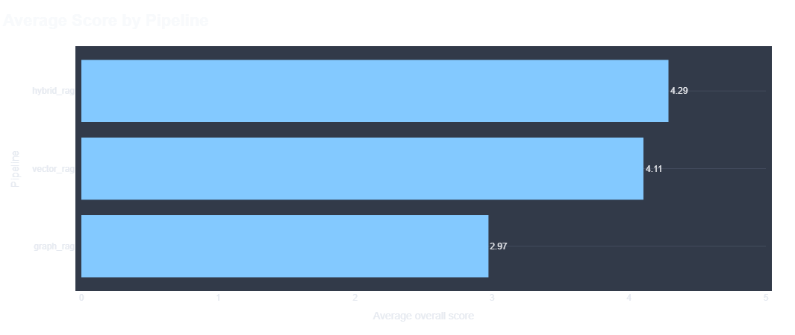

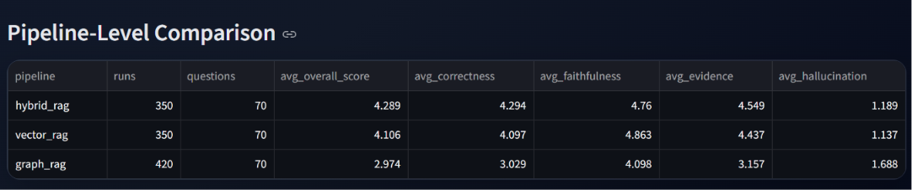

### Graph Metrics

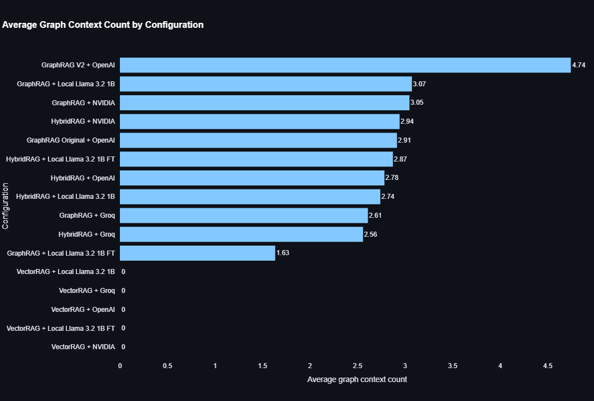

### Latency and Resource Analysis

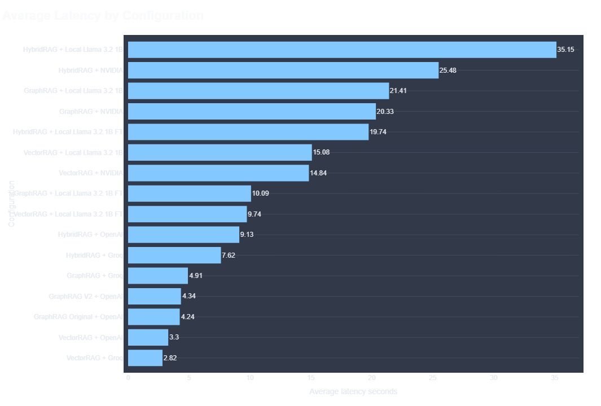

### Latency and Overall Analysis

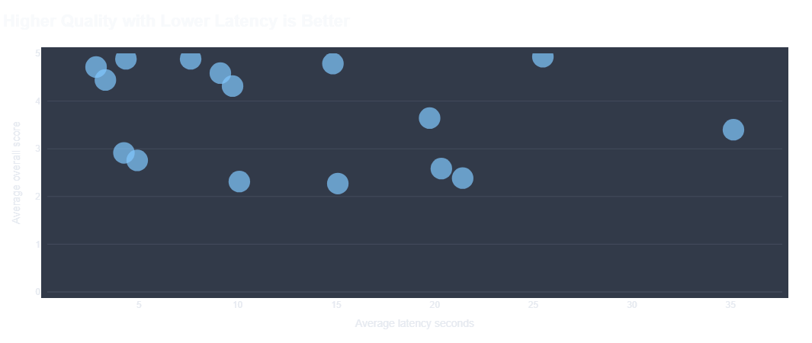

### Quality Metrics

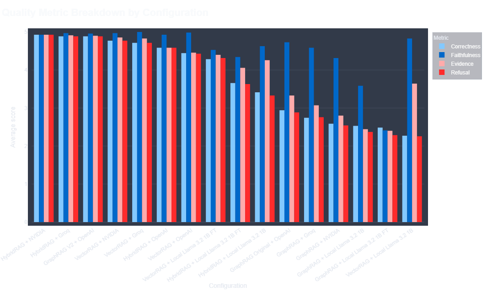

## Key Finding — Prompt Engineering Impact

GraphRAG with optimized prompt (V2): **4.89**
GraphRAG with basic prompt (V1): **2.91**
**Improvement: +68% from prompt engineering alone**

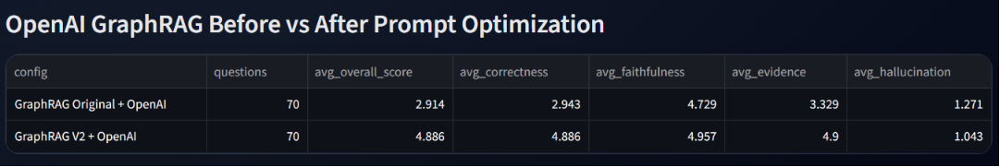

| Model                  | GraphRAG  | GraphRAG V2 |
|------------------------|-----------|-------------|
| OpenAI GPT-4o Mini     |   2.91    |     4.89    |

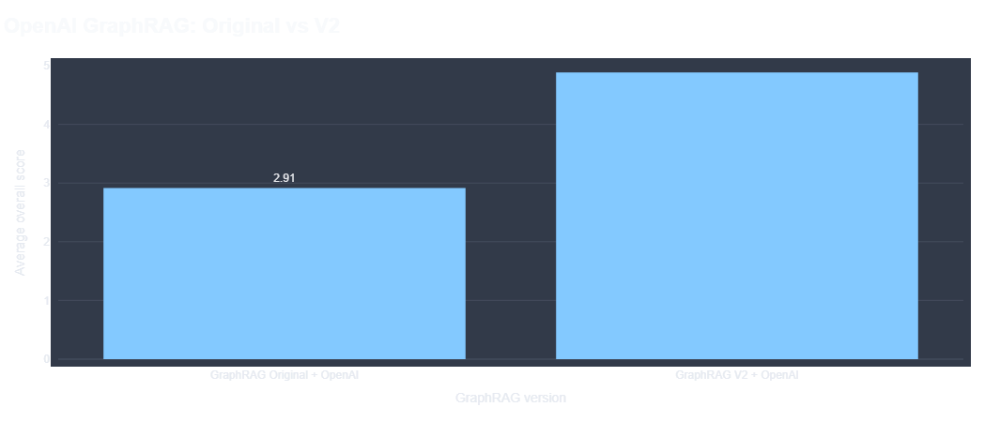

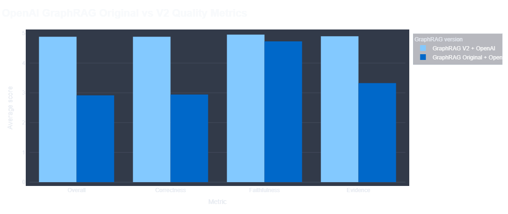

This demonstrates that prompt design can be more
impactful than model selection in RAG systems.

1. HybridRAG was the strongest overall approach

HybridRAG consistently performed well because it combines semantic retrieval with graph-based relationship retrieval. This made it more stable across different question types.

2. GraphRAG is powerful but fragile

GraphRAG underperformed in the first implementation because generated Cypher queries were often too weak, incomplete, or not aligned with the graph schema.
After improving the prompt, OpenAI GraphRAG V2 became one of the best-performing configurations.

3. VectorRAG was reliable for semantic questions

VectorRAG performed well on questions where the answer could be found through semantic similarity, but it was weaker for relationship-heavy questions.

4. Local models improved after fine-tuning

The fine-tuned local model performed better than the base local model in several configurations, especially in VectorRAG.

## CYPHER_GENERATION_TEMPLATE(OLD) & CYPHER_GENERATION_TEMPLATE(NEW)

Check in ("src\graph\prompt.py")

## FINETUNING LOCAL LLM - llama3.2-1b
A local llm was downloaded(llama3.2-1b-gguf) and was finetuned with some domain specific data and as the result the overall score was significantly better compared to the same model that was not finetuned

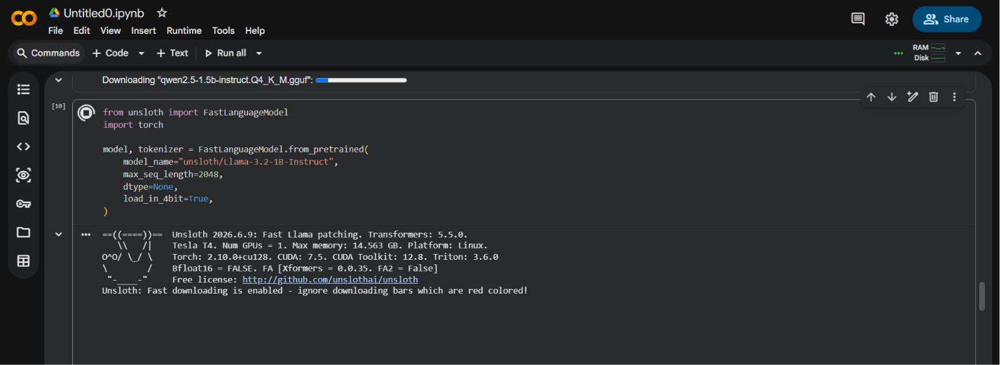

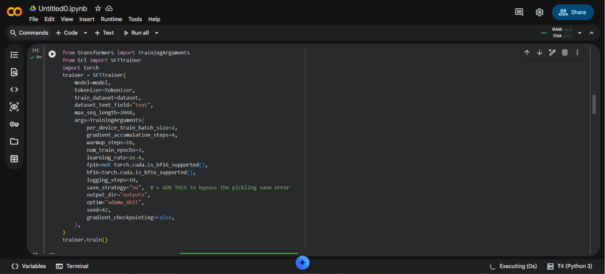

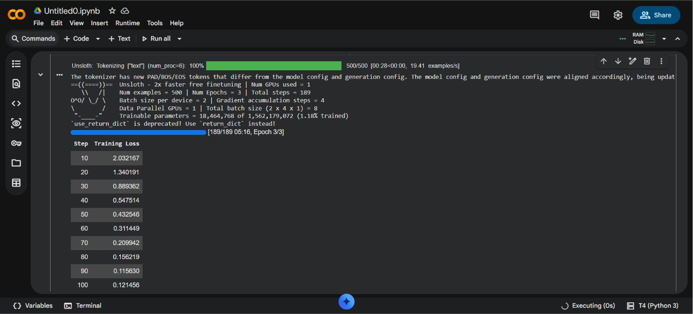

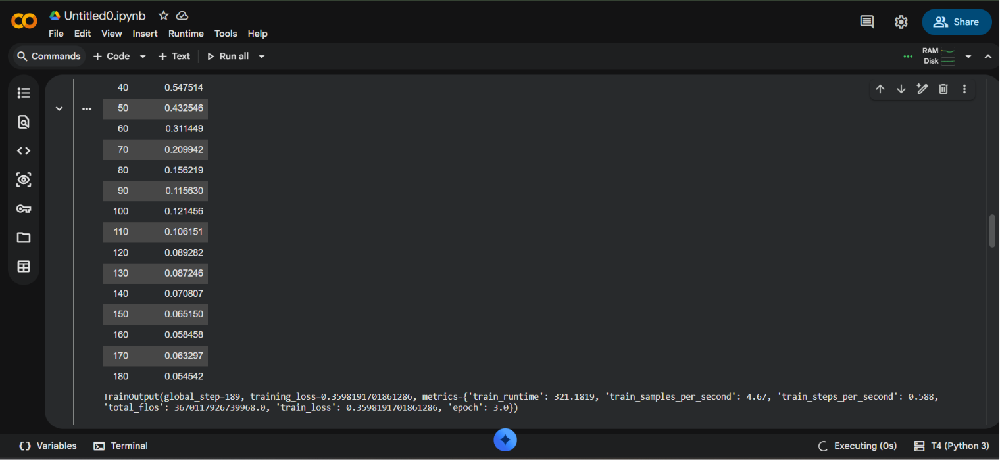

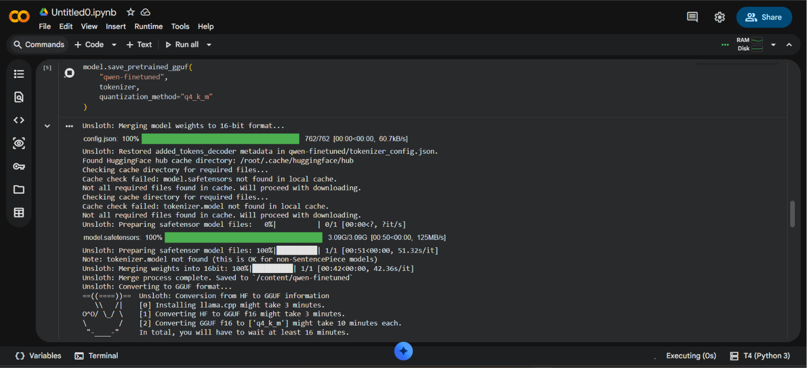

## Benchmark Data

The benchmark CSV contains one row per question run. Each row stores:

Question details,
Pipeline name,
Answer model,
Generated answer,
Generated Cypher,
Graph evidence,
Vector evidence,
Evaluation scores,
Latency,
Batch metadata and
Resource readings

## Technologies Used
Python
LangChain
Neo4j
Streamlit
Plotly
Pandas
Docker
Docker Compose
OpenAI API
NVIDIA API
Groq API
Local LLM inference
Langsmith

## Limitations
CPU and RAM readings are treated as observability snapshots, not exact process-level benchmark measurements.
Some GraphRAG results depend heavily on the quality of generated Cypher.
The benchmark uses a fixed dataset of 70 questions, so results are specific to this dataset and graph structure.
Local LLM performance depends on hardware, model size, and inference setup.
Cost and token analysis can be expanded further using complete LangSmith or provider-level token exports.

## Development note: 
AI tools were used as coding assistance during dashboard development and validated by the author.

## Conclusion

This project shows that retrieval strategy has a major impact on RAG answer quality. HybridRAG produced the most stable results overall, while GraphRAG became highly competitive only after improving Cypher generation.

The main takeaway is that GraphRAG is not automatically better than VectorRAG. It becomes useful when the graph schema, Cypher generation, and evidence retrieval are reliable. A strong RAG system needs both good retrieval design and strong evaluation, not just a working chatbot interface.
